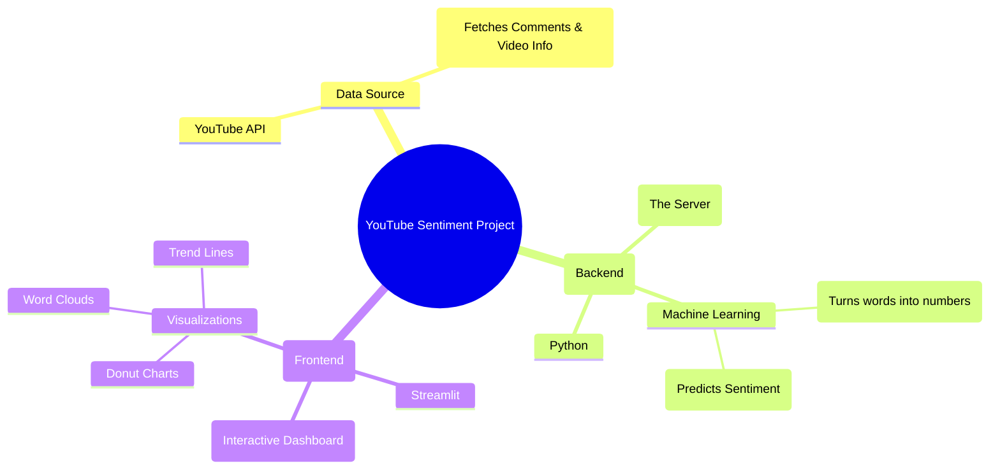

# 🎓 Final Year Project Report: YouTube Sentiment Analysis

## 🌟 Project Overview
**"What is the vibe of this video?"**
Instead of reading thousands of comments manually, our AI dashboard instantly analyzes them to tell you if the audience is Happy, Angry, or Neutral.

---

## 🧠 The "Mind Map" of Our Project
Here is a visual map of how we built this system, from the data source to the final dashboard.

---

## 🛠️ How We Built It (Step-by-Step)

### 1. The Data Source (YouTube API) 📥
*   **Problem**: We need comments to analyze.
*   **Solution**: We used the **YouTube Data API**.
*   **How it works**: You paste a video URL, and our app asks YouTube, "Hey, give me the top 200 comments for this video."

### 2. The Brain (Machine Learning Model) 🤖
*   **Problem**: Computers don't understand English; they understand numbers.
*   **Solution**: We trained a Machine Learning model.
    *   **Step A (Preprocessing)**: We cleaned the text (removed emojis, links, and weird symbols).
    *   **Step B (Vectorization)**: We used **TF-IDF** to turn words into math vectors.
    *   **Step C (Prediction)**: We used a **Logistic Regression** model to classify each comment as **Positive** or **Negative**.

### 3. The Engine (FastAPI Backend) ⚙️
*   **Problem**: The model is just a file. We need a way to talk to it.
*   **Solution**: We built an API using **FastAPI**.
*   **Role**: It acts as the waiter. It takes the URL from the user, runs the ML model in the kitchen, and serves the results back.

### 4. The Dashboard (Streamlit Frontend) 📊
*   **Problem**: We need a nice interface to show the results.
*   **Solution**: We used **Streamlit**.
*   **Why?**: It allows us to build beautiful, interactive data dashboards quickly using Python.

---

## 🔍 Key Features Explained

### 1. Sentiment Score & Polarity 🌡️
*   **Sentiment Score**: A single number from -1 (Hated it) to +1 (Loved it).
*   **Polarity Index**: How "strong" the opinions are. High polarity means people are very passionate (either loving or hating).

### 2. The Word Cloud ☁️
*   **What is it?**: A visual cluster of words.
*   **Logic**: Bigger words = Used more often. Green words = Used in positive comments. Red words = Used in negative comments.

### 3. Trend Analysis 📈
*   **What is it?**: A line chart showing feelings over time.
*   **Use Case**: Did the video start good but get boring? The trend line shows exactly when the sentiment dropped.

---

## 🏁 Conclusion
We successfully built an end-to-end application that solves the problem of "Information Overload" in comment sections. It combines **Data Engineering** (API), **Data Science** (ML), and **Web Development** (Streamlit) into one cohesive tool.
